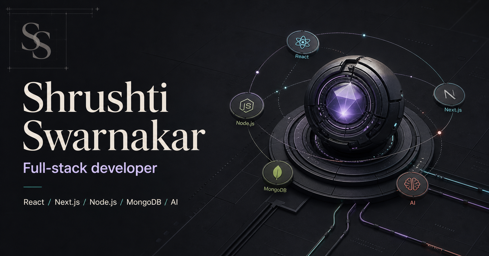

# Shrushti Swarnakar — Portfolio

A modern and responsive developer portfolio showcasing my full stack projects, technical skills, certificates, achievements, and development journey.

The portfolio features a clean dark interface, smooth animations, interactive project showcases, detailed case studies, and a custom CGI-inspired hero section.

## Live Portfolio

[View Live Portfolio](https://portfolio-nine-rho-gcua117klc.vercel.app)



## About Me

I’m Shrushti Swarnakar, a Full Stack Developer and BCA graduate from Pune, India. I enjoy building responsive web applications that combine thoughtful design with reliable functionality.

My work includes AI-powered platforms, cloud storage applications, marketplace systems, authentication flows, REST APIs, and database-driven dashboards. I am currently looking for Software Engineer, Full Stack Developer, and Backend Developer opportunities.

## Features

- Clean, modern, and responsive user interface
- Interactive CGI-inspired hero section
- Smooth reveal animations and transitions
- Selected projects with screenshots and live links
- Dedicated case study pages for major projects
- Interactive technology constellation
- Project filtering based on development category
- Certificates and achievements section
- Downloadable resume
- GitHub, LinkedIn, LeetCode, and email links
- Responsive navigation for desktop and mobile devices
- Accessible labels and keyboard-friendly controls
- SEO metadata, sitemap, and robots configuration
- Local font loading for improved performance
- Vercel and Cloudflare Worker deployment support

## Selected Projects

### Strategy Hub

An AI-powered interview preparation platform that provides resume feedback, ATS guidance, interview questions, saved reports, and personalized learning roadmaps.

**Technologies:** Next.js, React, TypeScript, Node.js, Express.js, MongoDB, JWT, Gemini AI

[Live Demo](https://strategy-hub-interview-app.vercel.app) · [GitHub Repository](https://github.com/Shrushti2003/Strategy-Hub-Interview-App)

### Zylora

A circular economy platform designed for buying, selling, donating, and discovering reusable items. It includes geolocation, role-based dashboards, messaging, and AI-assisted pricing.

**Technologies:** React, TypeScript, Node.js, Express.js, MongoDB, Firebase, Leaflet, Docker

[Live Demo](https://zylora-frontend.vercel.app) · [GitHub Repository](https://github.com/Shrushti2003/Zylora)

### CloudNest Drive

A cloud storage dashboard for uploading, organizing, previewing, sharing, and recovering files. It also includes account storage limits, subscription screens, and support flows.

**Technologies:** React, Vite, Node.js, Express.js, MongoDB, Cloudinary, Stripe, JWT

[Live Demo](https://cloudnest-liart.vercel.app) · [GitHub Repository](https://github.com/Shrushti2003/Google-Drive-Clone)

### LumiBooks

A responsive online bookstore that allows users to explore books, browse categories, view book details, and access a dedicated reading interface.

**Technologies:** Next.js, React, TypeScript, Node.js, MongoDB, Tailwind CSS

[Live Demo](https://lumibooks.vercel.app) · [GitHub Repository](https://github.com/Shrushti2003/Online-Book-Store)

### Netflix Clone

A responsive streaming platform interface with authentication screens, movie and series browsing, content details, and person pages.

**Technologies:** React, Vite, Node.js, Express.js, MongoDB, JWT

[GitHub Repository](https://github.com/Shrushti2003/netflix-clone)

## Technology Stack

### Frontend

- React
- Next.js
- TypeScript
- JavaScript
- HTML5
- CSS3
- Tailwind CSS
- Vite

### Backend

- Node.js
- Express.js
- REST APIs
- JWT Authentication

### Database and Storage

- MongoDB
- Mongoose
- Firebase
- Cloudinary

### Tools

- Git
- GitHub
- Vercel
- Cloudflare Workers
- Wrangler
- ESLint

### Portfolio-Specific Technologies

- React 19
- Next.js 16
- TypeScript
- Vinext
- Vite
- Framer Motion
- Lucide React
- Radix UI
- Local Geist fonts

## Project Structure

```text
app/
├── projects/[slug]/       Dynamic project case-study routes
├── globals.css            Global styles and responsive design
├── layout.tsx             Root layout and metadata
├── page.tsx               Main portfolio page
├── robots.ts              Search engine crawling rules
└── sitemap.ts             Generated sitemap

components/
├── animations/            Cursor and reveal animations
├── layout/                Navigation components
├── sections/              Portfolio sections and case studies
└── ui/                    Reusable interface components

lib/
├── portfolio-data.ts      Projects, skills and portfolio content
├── site-config.ts         Site metadata and public URL
└── utils.ts               Shared utility functions

public/
├── certificates/          Certificate files and previews
├── documents/             Downloadable resume
├── fonts/                 Local Geist font files
├── media/                 Hero artwork and media
└── projects/              Project screenshots

tests/                     Server-rendered route tests
types/                     Shared TypeScript definitions
worker/                    Cloudflare Worker entry
```

## Getting Started

### Prerequisites

Install the following before running the project:

- Node.js 22.13 or newer
- npm

### Installation

1. Clone the repository:

```bash
git clone https://github.com/Shrushti2003/your-portfolio-repository.git
```

2. Open the project directory:

```bash
cd your-portfolio-repository
```

3. Install the dependencies:

```bash
npm install
```

4. Start the development server:

```bash
npm run dev
```

5. Open the local URL displayed in the terminal.

## Environment Variables

The portfolio does not require private runtime secrets.

To configure the public website URL, create a `.env.local` file in the project root:

```env
NEXT_PUBLIC_SITE_URL=https://your-domain.vercel.app
```

Use `.env.example` as the template.

Do not commit `.env.local` or any file containing private credentials.

## Available Commands

```bash
npm run dev
```

Starts the Vinext development server.

```bash
npm run build
```

Creates the Vinext and Cloudflare Worker production build.

```bash
npm run build:vercel
```

Creates the production build for Vercel.

```bash
npm run start
```

Runs the generated Worker build locally.

```bash
npm run lint
```

Checks the project using ESLint.

```bash
npm run typecheck
```

Checks TypeScript types without generating output.

```bash
npm test
```

Builds the project and runs server-rendered route tests.

## Deployment on Vercel

1. Push the project to a GitHub repository.
2. Import the repository into Vercel.
3. Set the build command to:

```bash
npm run build:vercel
```

4. Add the following environment variable:

```env
NEXT_PUBLIC_SITE_URL=https://your-final-domain.vercel.app
```

5. Deploy the project.

The included `vercel.json` configures the Vercel build process.

## Performance and Accessibility

The portfolio includes:

- Responsive layouts for different screen sizes
- Locally hosted fonts
- Optimized WebP hero artwork
- Lightweight interface animations
- Reduced-motion support
- Semantic page sections
- Accessible labels for icon-only controls
- Keyboard-friendly interactive elements
- SEO-friendly metadata
- Sitemap and robots configuration

## Achievements

- Solved 423+ problems on LeetCode
- Built and deployed multiple AI-powered and full stack applications
- Completed Full Stack Web Development training
- Earned Data Structures completion and excellence certificates

## Contact

I am open to Software Engineer, Full Stack Developer, and Backend Developer opportunities.

- **Email:** [swarnakarshrushti@gmail.com](mailto:swarnakarshrushti@gmail.com)
- **LinkedIn:** [Shrushti Swarnakar](https://www.linkedin.com/in/shrushti-swarnakar/)
- **GitHub:** [Shrushti2003](https://github.com/Shrushti2003)
- **LeetCode:** [Shrushti2003](https://leetcode.com/u/Shrushti2003/)
- **Portfolio:** [View Website](https://portfolio-nine-rho-gcua117klc.vercel.app)

## Author

Designed and developed by **Shrushti Swarnakar**.
